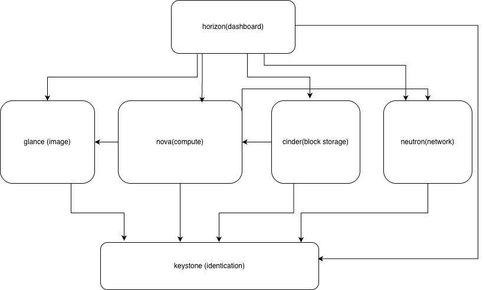

# OpenStack


- [OpenStack](#openstack)
- [1. Installation using devstack](#1-installation-using-devstack)
- [2. Validation of the installation](#2-validation-of-the-installation)
- [3. VM Deployment](#3-vm-deployment)
- [4. Port forwarding](#4-port-forwarding)
- [5. Diagram](#5-diagram)
# 1. Installation using devstack
```
# creating a user
sudo useradd -s /bin/bash -d /opt/stack -m stack
#make it executable
sudo chmod +x /opt/stack
# add it to sudoers
echo "stack ALL=(ALL) NOPASSWD: ALL" | sudo tee /etc/sudoers.d/stack
#switch to user
sudo -u stack -i
#cloning devstack repo
git clone https://opendev.org/openstack/devstack
cd devstack
```
create local.conf:

[local.conf](local.conf)

```
#running the script to install openstack
./stack.sh
```
# 2. Validation of the installation
   
check summary log at /opt/stack/logs:

```
source /opt/stack/devstack/openrc [user] [project]
openstack --version
openstack service list
sudo systemctl list-units | grep "devstack@*"
```
check dashboard:

http://188.34.101.189/dashboard

# 3. VM Deployment

create a key pair
add rules to the default security group for ssh and icmp

```
#creating a VM
openstack server create --image cirros-0.6.3-x86_64-disk --flavor m1.nano --key-name sshkeys --boot-from-volume 1 --network private [VM name]
#create a floating address
openstack floating ip create public
# add a floating adress to VM
openstack server add floating ip [VM name] [floating ip]
```
after that we can ssh into VM from the host

# 4. Port forwarding
   
needed if you'd like to ssh from desktop

add a range of ports to security group of the network your server uses on the stackit portal
use port forwarding script:

[port forwarding script](forward.sh)

now ssh from desktop using 

`ssh -p [port] user@host_ip`

# 5. Diagram
